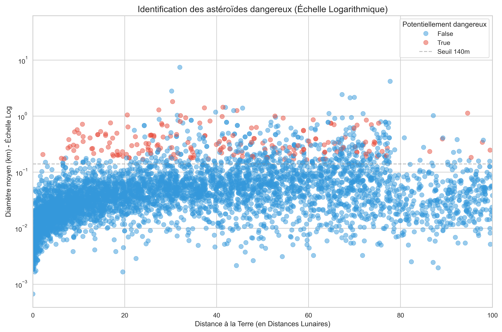

# PROJET YDAYS 
## Analyses de la dangerosité des géocroiseurs 
---

## Objectifs

Réaliser une **analyse exploratoire** et un document interactif (type PowerBI) pour évaluer les facteurs qui rendent un objet astronomique (geocroiseur) dangereux pour la Terre.
Le projet a pour but de **concevoir une pipeline** qui permet de collecter des données fournies par la **NASA** grâce à une API.

Voici les étapes clés du projet :

- **Choisir** l'API la plus pertinente dans [le site officiel de la NASA](https://api.nasa.gov/)
- **Collecter** les données brutes en format .csv
- **Nettoyer** les données
- **Analyse** exploratoire 
- **Présentation** et mise en évidence des facteurs clés qui influencent la dangerosité d'un objet

La présentation du Notebook et du Power BI incluront à la fois les données explorées et les connaissances personnelles pour répondre aux objectifs du projet.

### Aperçu de l'analyse

*La délimitation rouge correspond au seuil critique établi par la NASA qui détermine le diamètre minimum de l'objet pour qu'il soit considéré comme dangereux pour la Terre.*
*L'analyse montre une concentration critique sous les 20 distances lunaires. 70% des objets observés en dessous de cette distance possédant une diamètre supérieur à 140m sont considérés comme dangereux.*

--- ANALYSE DE LA POPULATION CRITIQUE (> 140m) ---

Tranche Distance | Total Objets | Dangereux  | % de Danger 
-------------------------------------------------------
0-20 LD         | 55           | 39         | 70.9%
20-40 LD        | 138          | 57         | 41.3%
40-60 LD        | 193          | 49         | 25.4%
60-80 LD        | 195          | 40         | 20.5%
80-100 LD       | 22           | 6          | 27.3%

*Ce tableau nous montre le ratio entre le nombre d'objets observés et ceux classés comme dangereux, faisant plus de 140m de diamètre, en fonction de la distance par rapport à la Terre.*
*On remarque que la proximité joue un rôle dans la dangerosité parmis les plus gros objets observés.*

### Projet conçu et réalisé par Florent FOLLIARD (B1 IA/DATA Paris Ynov Campus) dans le cadre du Ydays "Labo IA/Data"
