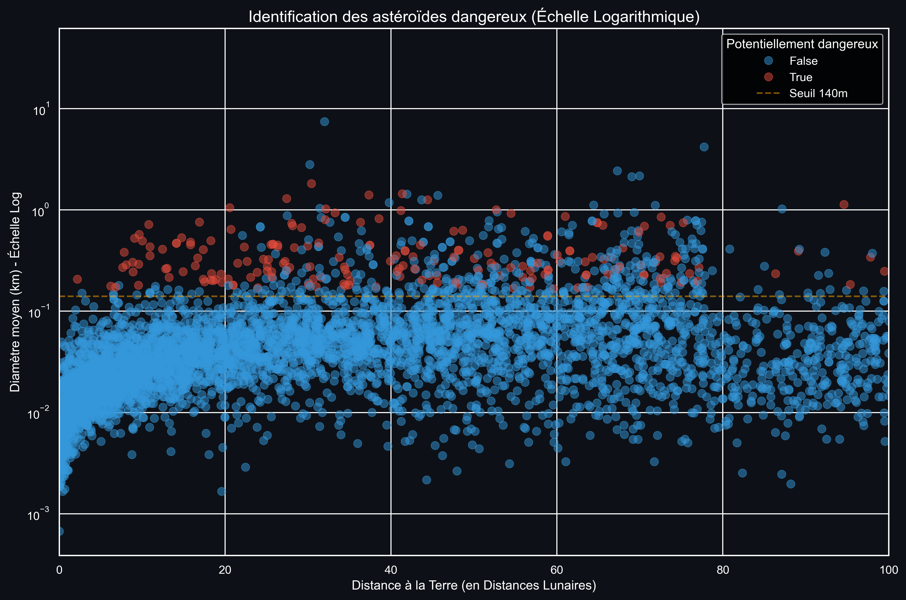
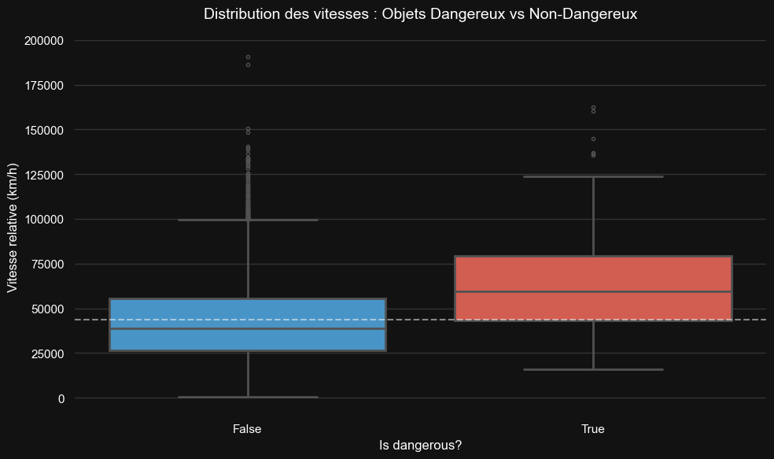
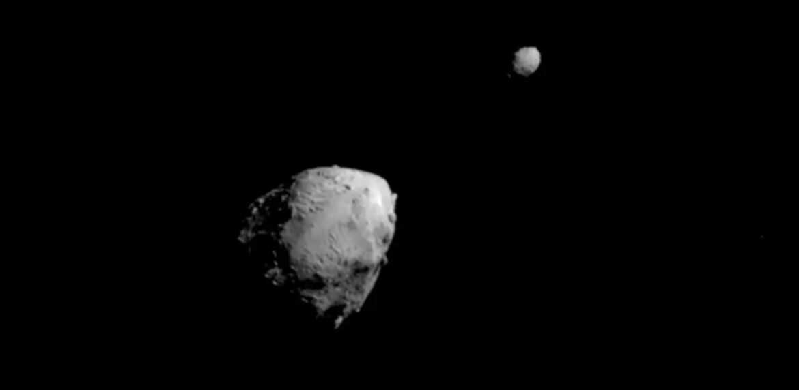

  

# ☄️ Surveillance des Géo-croiseurs (NEO)
> **Analyse de la dangerosité des objets orbitaux via l'API NASA.**

---

## 🎯 Objectifs du Projet
Concevoir une pipeline de données complète pour évaluer les risques d'impact planétaire.

* **Extraction :** Collecte automatisée via l'API "NeoWs" fournie par la NASA.
* **Engineering :** Nettoyage et structuration des données brutes avec Pandas.
* **Analyse :** Identification des facteurs clés (Diamètre vs Distance) via Python/Seaborn.
* **Visualisation :** Création d'un dashboard interactif Power BI.

## 🛠️ Stack Technique

---

## 🚀 Installation & Utilisation

Pour cloner ce projet et reproduire l'analyse sur votre machine, suivez ces étapes :

1. __Prérequis :__

  Python 3.8 ou supérieur.

  Une clé API NASA (gratuite). Obtenez-la ici : api.nasa.gov.

2. __Clonage du projet :__

  >git clone https://github.com/FlorentFolliard/Projet_Ydays_Nasa.git

3. __Configuration de l'environnement virtuel :__

  Création du venv

  >python -m venv venv

  Activation (Windows)

  >.\venv\Scripts\activate

  Activation (Linux/macOS)

  >source venv/bin/activate

4. __Installation des dépendances :__

  >pip install -r requirements.txt

5. __Configuration des variables d'environnement :__

  Créez un fichier .env à la racine du projet et ajoutez votre clé API :

  >NASA_API_KEY=votre_cle_ici

6. __Lancement de la pipeline :__

  >python main.py

---

## 🔍 Aperçu de l'Analyse Exploratoire (EDA)

>Dans cet aperçu, on a récupéré les objets observés depuis **janvier 2025**. 
>Ce graphique contient environ **6200** objets après nettoyage.

### 🔬 Pourquoi le seuil des 140 mètres ?

L'analyse se base sur la norme officielle de la **NASA (CNEOS)**. Ce seuil n'est pas arbitraire :
- **Seuil de dévastation :** Un impacteur de +140m de diamètre dégage une énergie capable de raser une région entière.
- **Capacité de pénétration :** Les objets plus petits ont une forte probabilité de se désintégrer dans l'atmosphère avant d'atteindre le sol, limitant ainsi les dégâts à des ondes de choc locales.

*C'est ce qui explique pourquoi, dans nos données, aucun objet en dessous de ce diamètre n'est marqué comme dangereux par la NASA, même en cas de passage très proche.*

> **Insight Clé :** L'analyse confirme le seuil critique de la NASA. 100% des objets classés dangereux dépassent **140m de diamètre**. Cependant, la taille seule ne suffit pas : la proximité est le facteur aggravant.

### 📊 Risque relatif à la distance (Population > 140m)

| Tranche Distance | Total Objets | Objets Dangereux | Taux de Danger |
| :--- | :---: | :---: | :---: |
| **0-20 LD** | 55 | 39 | **70.9%** |
| **20-40 LD** | 138 | 57 | 41.3% |
| **40-60 LD** | 193 | 49 | 25.4% |
| **60-80 LD** | 195 | 40 | 20.5% |
| **80-100 LD** | 22 | 6 | 27.3% |

> Ce tableau nous montre que la distance joue un rôle parmis les candidats dépassants le seuil des 140m de diamètre.

> Ce boxplot met en évidence la différence de vitesse médiane pour les objets dangereux comparés aux objets non-dangereux.
> Cela met en évidence l'importance de la vitesse, et donc de l'énergie cinétique potentielle, dans la classification d'objets dangereux.

### Pour finir sur une note optimiste...

En septembre 2022, la NASA a mené à bien la mission __DART__ qui consistait à dévier la trajectoire d'un système binaire d'astéroïdes.
Comme on peut le voir sur la photographie ci-dessus, c'est un système binaire composé d'un petit astéroïde, __Dimorphos__ qui orbite autour d'un plus grand, __Didymos__.
La NASA a envoyé un projectile sur Dimorphos, qui l'a fait légèrement dévier dans son orbite autour de Didymos, qui a lui-même dévié de sa trajectoire suite à cet impact.
La mission est __un grand succès__, excédant les prédictions établies.
C'est donc une grande avancée dans la défense planétaire.

👉 **[Consulter le Notebook détaillé (Exploration Python)](./assets/notebooks/eda1.ipynb)**

### A votre tour !

Pour 

---

### 👤 Contact
**Florent FOLLIARD** - B1 IA/DATA Paris Ynov Campus

*Projet réalisé dans le cadre du Ydays "Labo IA/Data" 2025-2026*
